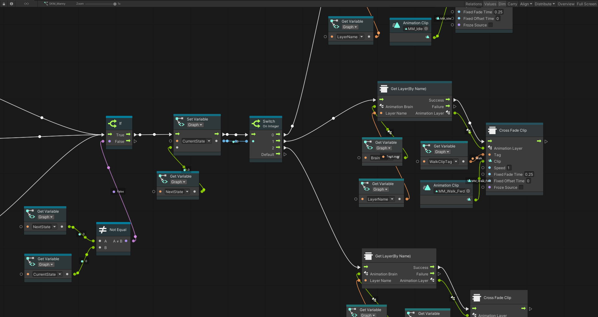
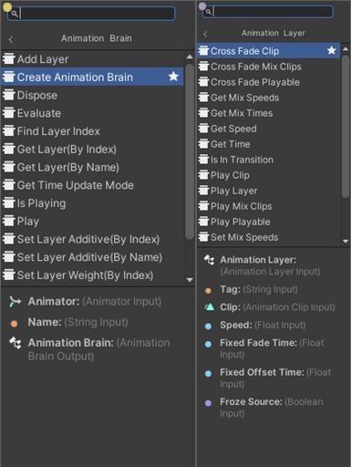
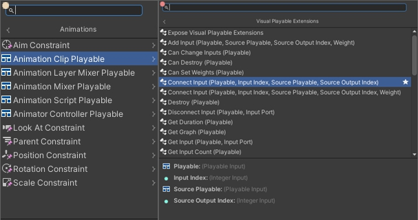

# UnityVisualPlayable

为Unity Visual Scripting接入 Playable 控制功能。

[English](./README.md)

## 功能

- High Level 动画节点
    - 生成自 `AnimationBrain` 类的节点：管理 `PlayableGraph` 和 `AnimationLayer` 
    - 生成自 `AnimationLayer` 类的节点：管理动画播放和过渡，也可以直接播放 `Playable` 实例（需要用户确保是动画相关的Playable实例）

- Low Level Playable节点
    - 生成自 `VisualPlayableExtensions` 类的节点 ：特化的 `UnityEngine.Playables.PlayableExtensions` ，提供基础的 Playable 控制功能
    - 生成自所有可公开访问的 Playable 相关类型的节点

## 用法

使用菜单选项 *Tools/Bamboo/Visual Playable/Setup Visual Playable* 向 Visual Scripting 系统批量注册 Playable 相关类型，然后即可在 Script Graph 和 State Graph 中使用这些类型的节点。
